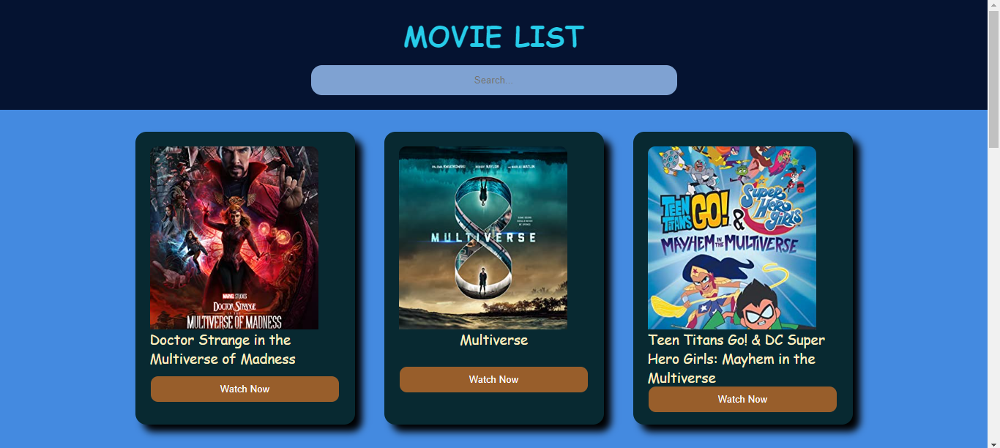

# Movie Search App

This is a simple web application that allows users to search for movies using the Open Movie Database (OMDb) API. The app displays movie results as cards, with each card containing the movie title, poster, and a "Watch Now" button. Users can search for specific movies, and trending movies are displayed when the page loads.

## Features

- Fetches movie data from the OMDb API using a provided API key.
- Displays movie search results as cards with relevant movie information.
- Allows instant movie search as the user types in the search query.
- Displays trending movies on page load.

## Technologies Used

- HTML: The structure of the web page.
- CSS: Styles the appearance of the web page and the movie cards.
- JavaScript: Implements the movie search functionality and API calls.
- OMDb API: Fetches movie data based on the user's search queries.
- Fetch API: Handles asynchronous requests to the OMDb API.
- Async/Await: Utilized for cleaner asynchronous code in fetching and displaying movies.
- DOM Manipulation: Dynamically updates the movie cards and error messages.

## Getting Started

1. Clone the repository or download the source code.

   git clone https://github.com/Rishabh6306/MileStone-Repo.git 

2. Open index.html in your preferred web browser.

## Usage
1. Type the name of the movie you want to search for in the input box.
2. As you type, the app will instantly display relevant movie search results.
3. Click on the "Watch Now" button to watch the movie (Note: This button is for demonstration purposes only and does not play the movie).

## Screenshots

Here are a few screenshots of CountryInfo Web App:

## Credits
1. Open Movie Database (OMDb) API: Provides movie data for the application.
2. Unsplash: Provides movie poster images for the trending movies.